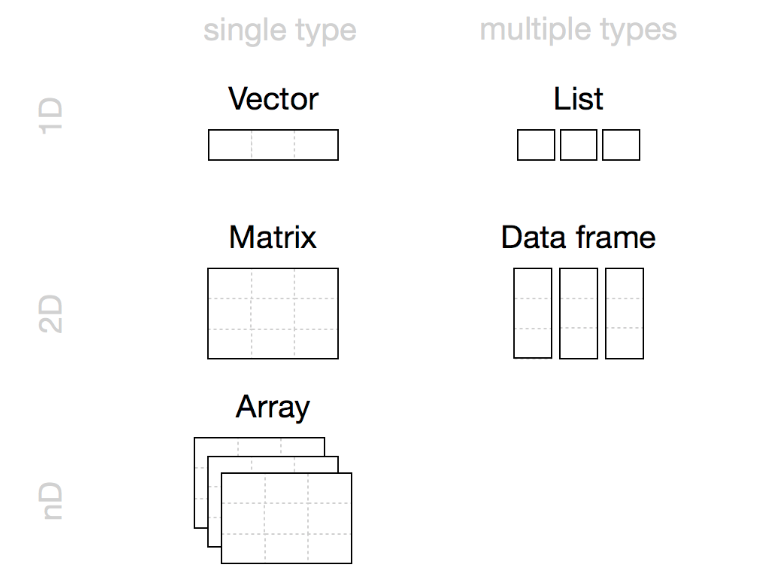

```{r setup, include=FALSE}
knitr::opts_chunk$set(
  comment = "#", fig.height = 3, 
  cache = FALSE,  collapse = TRUE,
  error = TRUE,
  tidy.opts=list(width.cutoff=65),
  tidy=TRUE
)
```

CSI 2300: Introduction to Data Science

Lecture 03:  Common Commands and Structures


<!-- \begin{center} -->
<!-- Lecture -->
<!-- \end{center} -->


# Today's Topics 


## Data Structures

## Common, Useful Commands

## Filtering Data


# Data Structures


There are different types of data in R, and those types can  be organized into different structures in R.  The types are


* **Character:**  This is text data.  For example, the variable "Class" may contain the entries "freshman," "sophomore," "junior," or "senior."
* **Numeric:**  These can be  integer or decimal-valued numbers.  These are the same as "doubles." 
* **Integer:**  These are whole number values, either positive or negative.
* **Logical:** These are either "TRUE" or "FALSE" designations.
* **Complex:** Values with real and imaginary parts, denoted for example as  `1+4i`. 
* **Date/Time:**  These are dates, without or without a specific time stamp associated with them.

These types can be collected and represented as follows:

* **Factor:** A whole column of character data is designated a factor where each unique outcome is called a "level.""
* **Vector:** A sequence of values of the same data type.
* **Matrix:**  A two-dimensional (rows and columns)  set of values and all must be numeric.
* **Array:**  A multi-dimensional set of values all of the same type.  A matrix is a special 2-D case.
* **Data Frame:** A very commonly used data structure in R.  It is two-dimensional with rows and columns, but each column can be a different data type.
* **List:**  A list has slots, and within each slot, you can have a different structure of different sizes stored.


\newpage

{width=80%}

Figure from \url{https://rstudio-education.github.io/hopr/r-objects.html}

We will work with many data frames, so they deserve some special attention.  You can read a dataset into R that is automatically treated as a data frame, or you can create one from scratch, as follows:
```{r}
friends <- data.frame(
    id_number = c(1, 2, 3, 4, 5, 6),
    name = c("Ross", "Rachel", "Monica", "Chandler", "Joey", "Phoebe"),
    birthday = as.Date(c("1966-11-02", "1969-02-11", "1964-06-15", "1969-08-19", "1967-07-25", "1963-07-30")),
    num_daily_coffees = c(3, 5, 2, 3, 2 ,8),
    stringsAsFactors = FALSE
)
friends
#friends$name; friends$birthday
```
You extract a particular column from a data frame by using the data frame's name followed by the `$` symbol and then the column name.  You can also add a new row or column as follows:
```{r, results="asis"}
#Add a new column
num_breakups <- c(5, 8, 7, 6, 3, 8)
friends <- cbind(friends, num_breakups)

#Add a new row--requires creating a new data frame for the row
new_person <- data.frame(id_number = 7, 
                         name = "Mike",  
                         birthday = as.Date("1969-04-06", format="%Y-%m-%d"), 
                         num_daily_coffees = 4, 
                         num_breakups = 0)
friends <- rbind(friends, new_person)
```

***

**Example: Colorado Covid Data**  The following data is downloaded from the Colorado Department of Public Health and Environment^[https://cdphe.maps.arcgis.com/apps/opsdashboard/index.html#/d79cf93c3938470ca4bcc4823328946b]. It contains four main variables:

* The date
* The particular utility
* SARS CoV2 copies of RNA (measured as RNA/liter of water) in wastewater
* The number of new Covid-19 cases

SARS-CoV-2 is the virus that causes COVID-19, and RNA is the genetic material in each copy of the virus. SARS-CoV-2 copies per liter is one measure of how much of the virus is in the wastewater, expressed as a concentration. Studies have shown that individuals who develop COVID-19 often shed detectable SARS-CoV-2 RNA from their systems before, during, and after their infection, so higher levels of SARS-CoV-2 RNA can indicate a rise in cases in a community.  Many universities used this method to monitor the wastewater from residence halls to obtain an early warning of a disease outbreak.

```{r}
covid <- read.csv(file="dat/CDPHE_COVID19_Wastewater_Dashboard_Data.csv", header=T)
class(covid)
head(covid)
dim(covid)
```

***


# The Kindergarten Commands of R

These commonly used commands are so widely used that they are often taken for granted!

* `rm(list=ls())`: removes everything in the global data environment, like erasing a chalkboard and starting over 

* `length()`:  returns the length of a vector or the number of elements in a matrix.  See also, `dim()`, `nrow()`, and `ncol`.

* `c()`:  combines values into a group, but they must all be the same data type

```{r}
c(5, 10, -2.5)
```


* `rep()`: repeats the same value (or sequence of values) a certain number of times
```{r}
rep(0, 5)
rep("Hi", len = 3)
rep(20:25, times = 2)
rep(20:25, each = 2)
```


* `seq()`: creates a sequence of numbers from a lower bound to an upper bound, of a given length or seperated by a given distance
```{r}
seq(1, 10, len = 21)
seq(1, 10, by = 0.5)
```


* The colon `:` used to rapidly create a sequence of integers
```{r}
1:7
-3:5
```


* `unique()` and `table()`: 

`unique` will return a list of the unique values in a vector or array and will discard the duplicates.  

`table` will tabulate and count up how many times a particular unique element occurs in a vector.
```{r}
#How many utilities are represented in the Covid dataset?
#unique(covid$Utility)
#table(covid$Utility)
```


# Filtering Data

Sometimes you want to select only those observations (rows) from a dataset that meet a certain criteria, such as only one particular utility in the Covid data.  To do so, you need to know the comparison expressions used in R:

* `x == y`  indicates x must equal y
* `x != y` indicates x must NOT equal y
* `x >= y` indicates x must be greater than or equal to y
* `x <= y` indicates x must be less than or equal to y
* `x > y` indicates x must be strictly greater than y
* `x < y` indicates x must be strictly less than  y

These are logicals that can be used with the comparisons above:

* `!a`  indicates not a
* `a & b`  indicates both a AND b must be true
* `a | b`  indicates either a OR b must be true


Finally, to apply basic filtering, you need to combine a logical statement with the square brackets.  Square brackets allow you to select either the rows or columns in a data frame, indicated as `dataframe[rows, columns]`.

```{r}
#Select row 4 and column 3
friends[4, 5]

#Selects row 2
friends[2, ]

#Selects column 3
friends[ ,3]

#Selects id_numbers 1 to 4
friends[1:4, ]

#Selects rows with number of daily coffees over 5
friends[friends$num_daily_coffees > 5, ]

#Selects rows with number of daily coffees over 3 AND number of breakups greater than or equal to 7
friends[(friends$num_daily_coffees > 4) & (friends$num_breakups >= 7), ]

#Selects rows with number of daily coffees over 3 OR number of breakups greater than or equal to 7
friends[(friends$num_daily_coffees > 4) | (friends$num_breakups >= 7), ]


```


***

**Example: Colorado Covid Data** Find the following subsets:

1. Find those rows of the dataset that pertain only to the Boulder utility.

2. Select those observations whose new Covid-19 cases are greater than 200.  What proportion of the dataset is this?

3. Select the rows that do not have any NAs in the RNA column.

```{r}
#Question 1
boulder_covid <- covid[covid$Utility == "Boulder", ]
#boulder_covid

#Question 2
high_counts <- covid[covid$Number_of_New_COVID19_Cases_by_ > 200, ]
nrow(high_counts) / nrow(covid) *100

#Question 3
covid_complete <- covid[is.na(covid$SARS_CoV_2_copies_L) == FALSE, ]
covid_complete <- covid[!is.na(covid$SARS_CoV_2_copies_L), ]
#Can also be split into two steps.
#rna_present_index <- is.na(covid$SARS_CoV_2_copies_L)
#covid_complete <- covid[!rna_present_index, ]
```

Are any of the columns of this dataset redundant?  How could you quickly remove a column?

```{r}
covid <- covid[ , -5]
```


